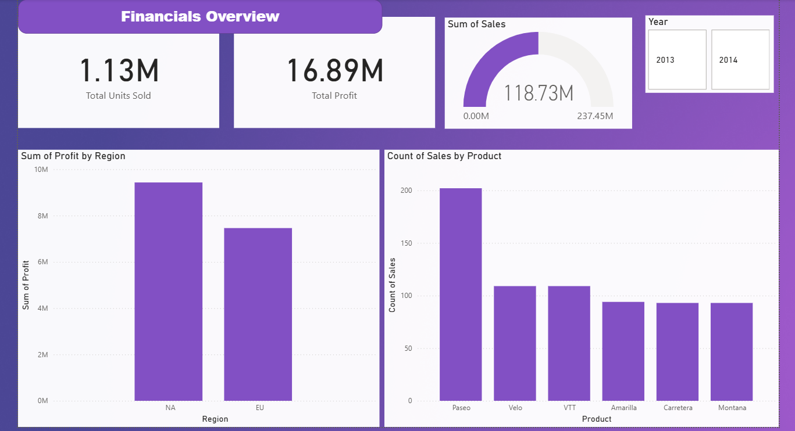
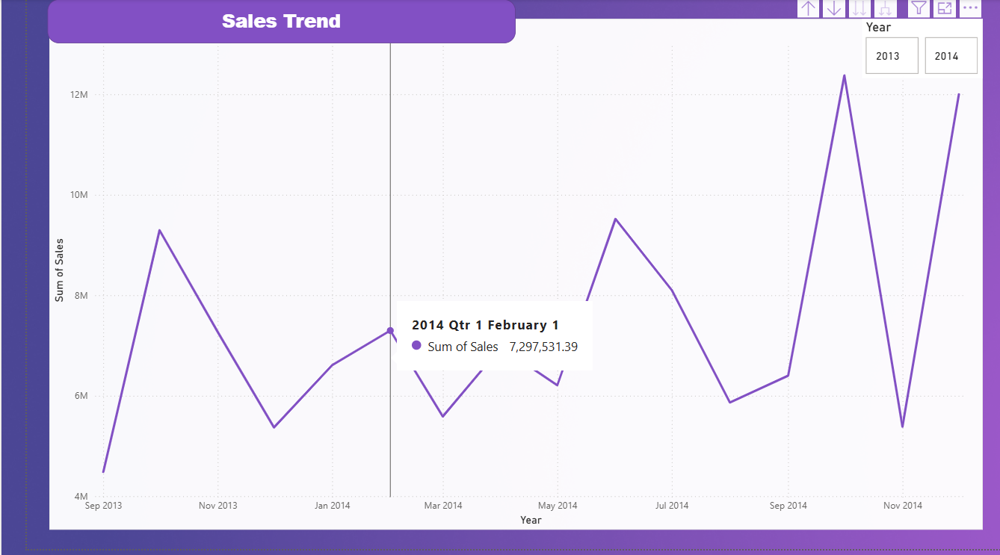
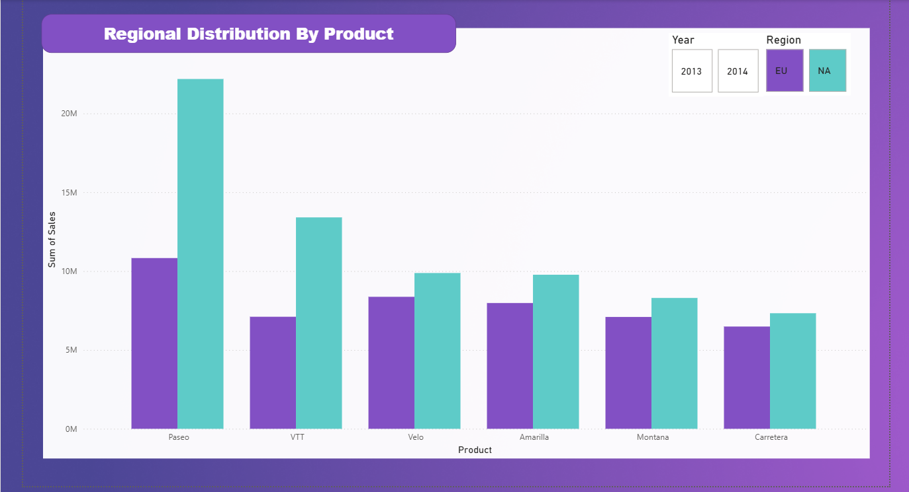
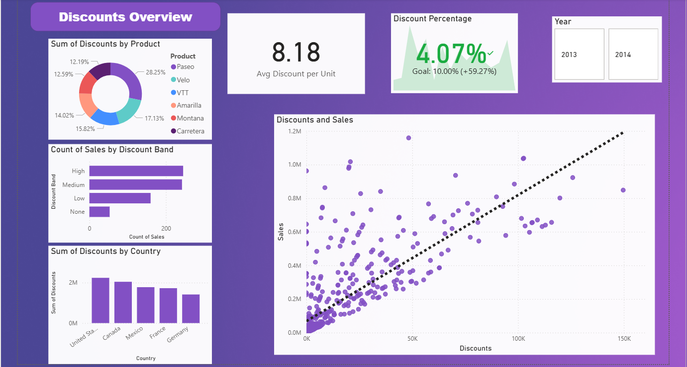

# 📊 Financial Report Dashboard (Sample Data)

An interactive **Power BI dashboard** built using Microsoft's **Financial Sample dataset**.  
This project showcases data visualization and analytics skills for **sales**, **profitability**, and **regional performance**.

---

## 📁 Dataset
**Source:** Microsoft Financial Sample (public demo data)

| Column | Description |
|---------|-------------|
| Country | Country of transaction |
| Segment | Customer segment (e.g., Government, Small Business) |
| Product | Product category |
| Discount Band | None, Low, Medium, High |
| Gross Sales | Total revenue before discounts |
| Discounts | Total discount amount |
| COGS | Cost of goods sold |
| Profit | Net profit |
| Date | Transaction date |

> *This is fictional data provided by Microsoft for learning purposes.*

---
## 📊 Dashboard Pages
1. **Financials Overview** – KPIs for Sales, Profit, Discounts, and Gross Margin

2. **Sales Trend** – Time-based sales and profit analysis

3. **Regional Distribution by Product** – Regional and product-level performance breakdown
  
4.. **Discounts Overview** – Discount distribution, impact on sales, and trends

